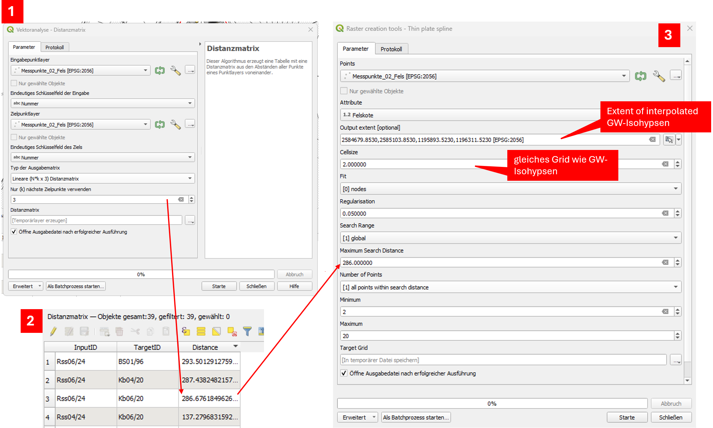
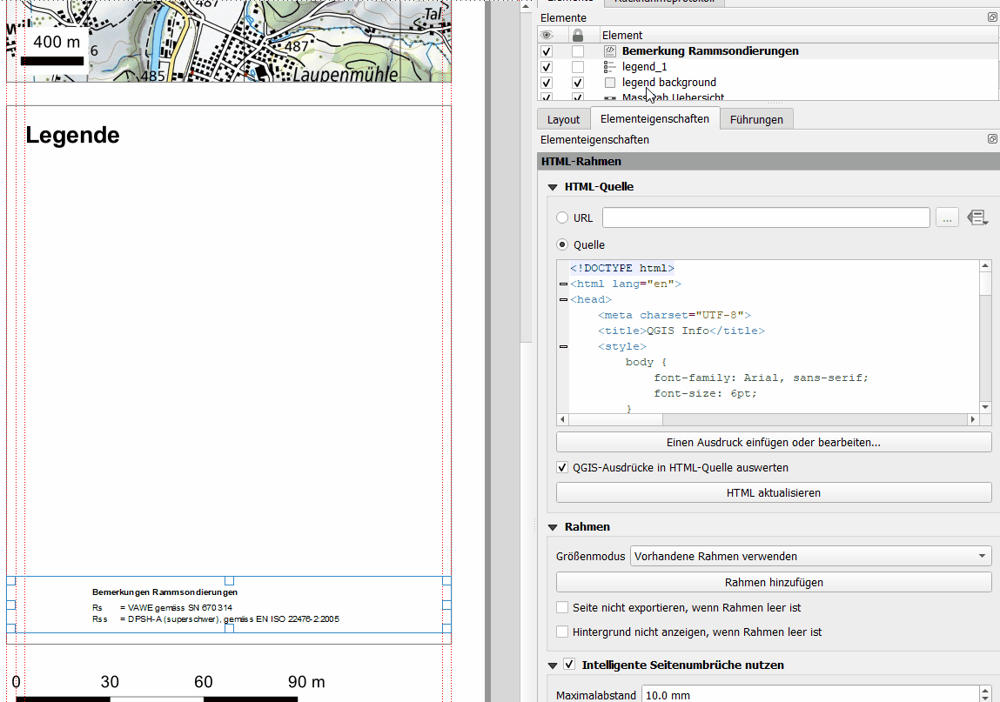

Documentation
===============

Headings
--------

Heading 1
Heading 2
Heading 3

Text
----

The quick brown fox jumps over the lazy dog.
Lorem ipsum dolor sit amet, consectetur adipiscing elit. 
Vivamus lacinia odio vitae vestibulum vestibulum.

Lists
-----

Item 1
Item 2
Subitem 2.1
Subitem 2.2Item 3

Tables
------

=============  =============
Header 1        Header 2
=============  =============
Cell 1          Cell 2
Cell 3          Cell 4
=============  =============

Admonitions
------------
.. note::
   This is a note admonition.

Media
-------

Images
~~~~~~

|

GIFs
~~~~

|

I would like to integrate an icon **color** in the documentation.

.. icons